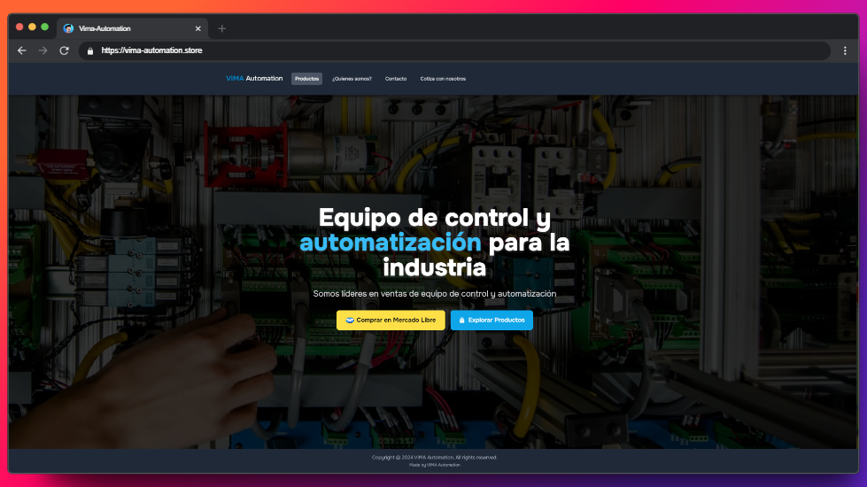

# VIMA Automation



## Descripción del Proyecto

VIMA Automation es una aplicación web diseñada para proporcionar información sobre soluciones de control y automatización industrial. Este proyecto incluye un menú colapsable, un slider de imágenes y secciones informativas sobre la empresa y sus servicios.

## Características

- **Menú Colapsable**: Un menú que se adapta a dispositivos móviles, permitiendo una navegación fácil y accesible.
- **Slider de Imágenes**: Un slider que muestra imágenes relevantes sobre la automatización industrial.
- **Secciones Informativas**: Información sobre la empresa, sus productos y cómo contactar.

## Tecnologías Utilizadas

-  Astro
-  Tailwind CSS
-  JavaScript

## Instalación

Para ejecutar este proyecto localmente, sigue estos pasos:

1. Clona el repositorio:

   ```bash
   git clone https://github.com/tu_usuario/vima-automation.git
   ```

2. Navega al directorio del proyecto:

   ```bash
   cd vima-automation
   ```

3. Abre el archivo `index.html` en tu navegador.

## Uso

- Haz clic en el botón del menú en la parte superior derecha para abrir y cerrar el menú colapsable.
- Navega a través de las secciones para obtener más información sobre VIMA Automation y sus servicios.

## Contribuciones

Las contribuciones son bienvenidas. Si deseas contribuir a este proyecto, por favor sigue estos pasos:

1. Haz un fork del repositorio.
2. Crea una nueva rama (`git checkout -b feature/nueva-caracteristica`).
3. Realiza tus cambios y haz un commit (`git commit -m 'Añadir nueva característica'`).
4. Envía tus cambios (`git push origin feature/nueva-caracteristica`).
5. Abre un Pull Request.

## Licencia

Este proyecto está bajo la Licencia MIT. Consulta el archivo [LICENSE](LICENSE) para más detalles.

## Contacto

Para más información, puedes contactar a:

- **Nombre**: Javier Villalvazo
- **Email**: javiervp41@gmail.com
- **GitHub**: [Javi505amx](https://github.com/Javi505amx)
- **LinkedIn**: [Javier Villalvazo](https://www.linkedin.com/in/javier-villalvazo/)